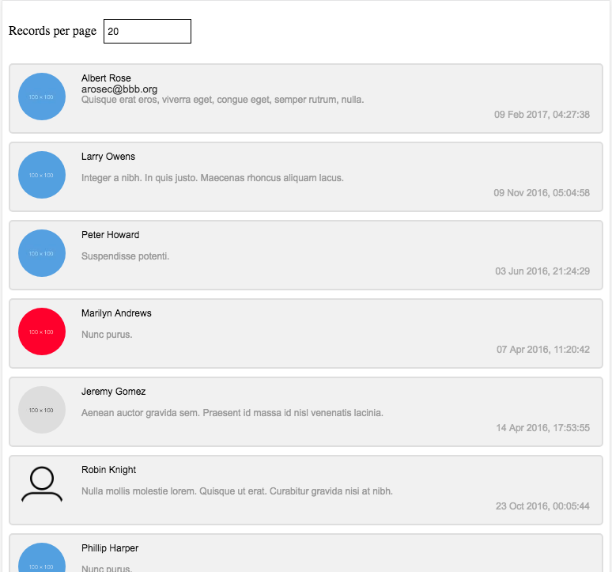
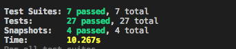

# NowTV React



## Commands

- **npm start**: Runs the web application in developer mode
- **npm test**: Executes Jest tests that have the `.spec.js` extension

## Tasks Implemented


1. In `service.js`, utilise the 'APIs' provided by `data.js` resolving to an array of chatlog messages in the following format, sorted by time.

```json
[
  {
    "messageId": "12356",
    "userId": "613651251",
    "fullName": "Robin Balmforth",
    "timestamp": "2017-02-23T14:57:20.629Z",
    "email": "robin@example.com",
    "message": "Hello, World!",
    "avatar": null
  },
  ...
]
```

2. Create a view of this dataset, with the root of your React application starting in `App.js`. Including:
  - Display the `avatar` where applicable
  - Display the `email` on hover
  - Format the timestamp to be human readable

3. TDD for the container and presentation components.
  - 
4. snapshots created for the container and presentation components.
5. Redux store is implemented and the reducers are unit tested.
6. Pushed on a public GitHub repository.

### Installation

1. git clone the online repository
2. make sure npm v@6.7.0 is installed
3. make sure node v@10.11.0 is installed
4. npm install
5. npm run build -  in order to build the distribution package
6. npm start - in order to run the application locally on http://localhost:3000
7. npm run test -u, in order to execute the TDD/Unit test 


## Tasks Pending

1. more feature files for the react components
2. Records per page filter needs to be added to redux store,  also the filtering action needs to be defined.


